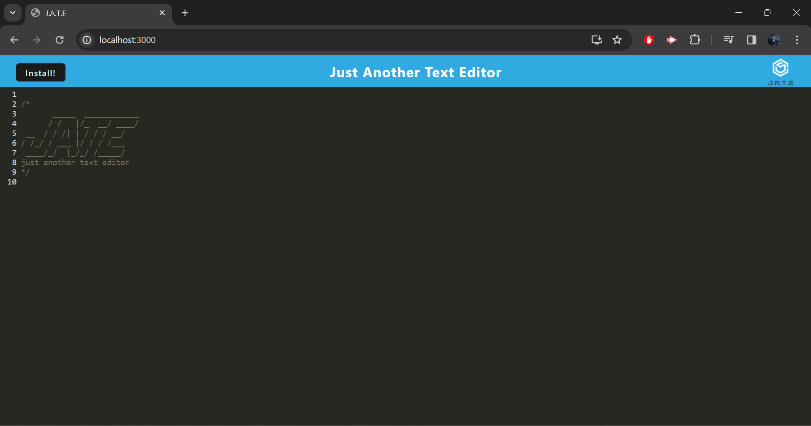
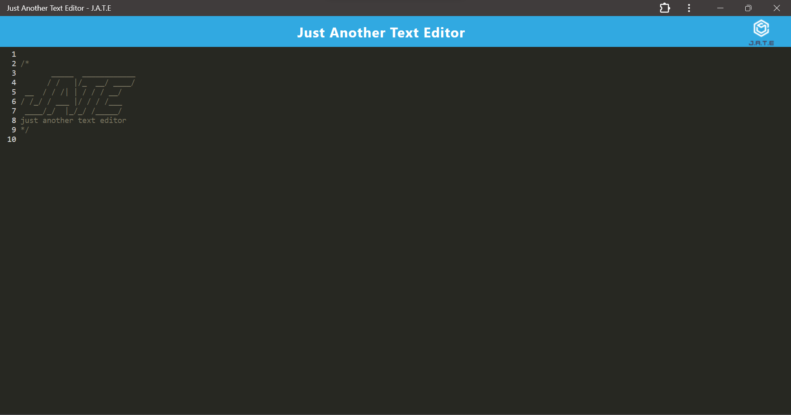

# PWA Text Editor

## Description

This application is a web based text editor that highlights JavaScript syntax. Additionally, it is a progressive web app (PWA) and can be installed on any device to work and feel like a native app.

## Table of Contents

[Local Installation](#local-installation)

[Usage](#usage)

[Questions](#questions)

## Local Installation

#### Follow these steps if you wish to build the app locally. Instructions to run the app locally can be found [here](#run-locally).

1. Clone this repository to your directory of choice.
2. Change directory into the newly cloned repository.
3. Run 'npm i' in the command line to install the necessary packages and dependencies.

## Usage

Click [here]() to open the deployed version of the app and use to your liking. Additionally, you can install the app by clicking the install button at the top left of the page. See below for images of the app being run both on the web browser and locally (installed) on a machine.

#### Run Locally

1. Once the dependencies are [installed](#local-installation), run 'npm start' in the command line to build and start the app.
2. Open the browser of your choice.
3. Type 'localhost:3000' in the search bar and then hit enter.
4. Use the app to your liking.
5. (optional) Click the install button at the top left of the page to install the app.

## Questions

[GitHub](https://github.com/bhansi)

If you have any questions, you can reach me via my [email](mailto:baljotshansi@gmail.com).
